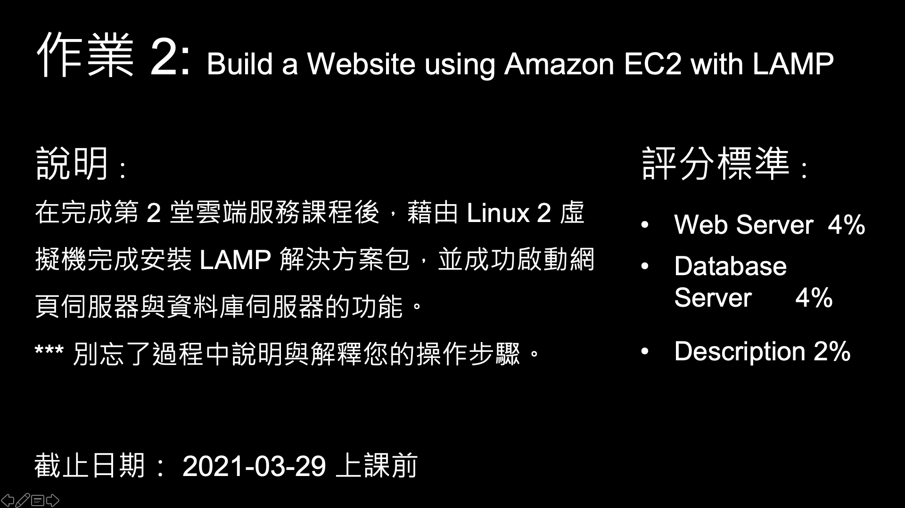
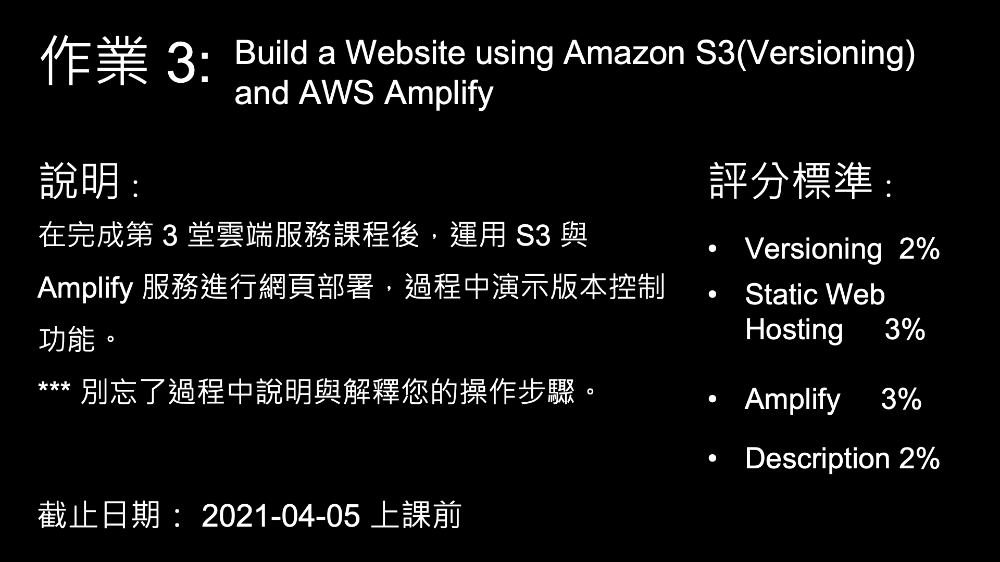
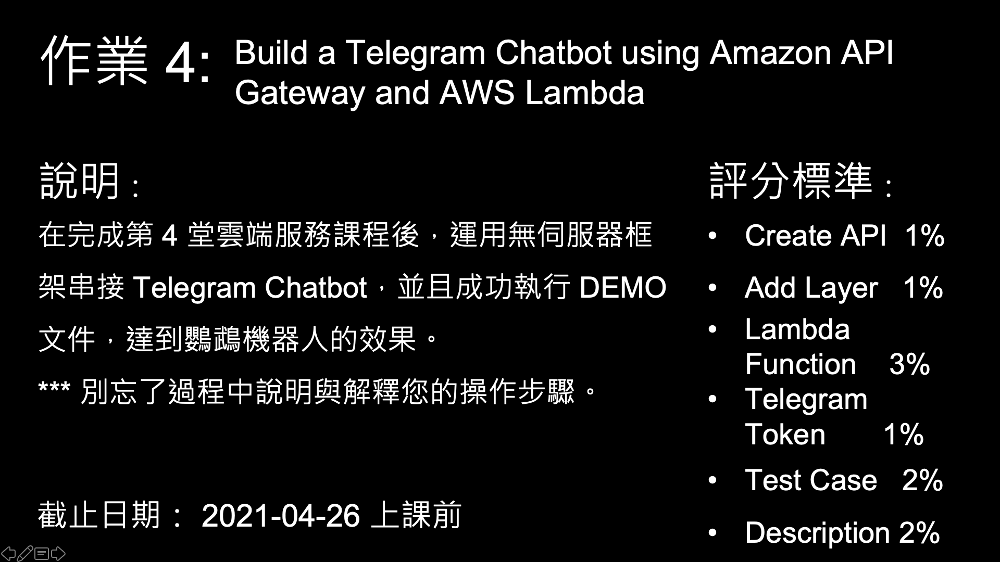
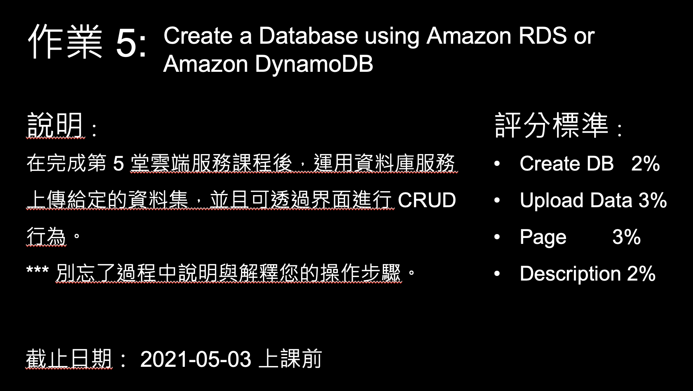
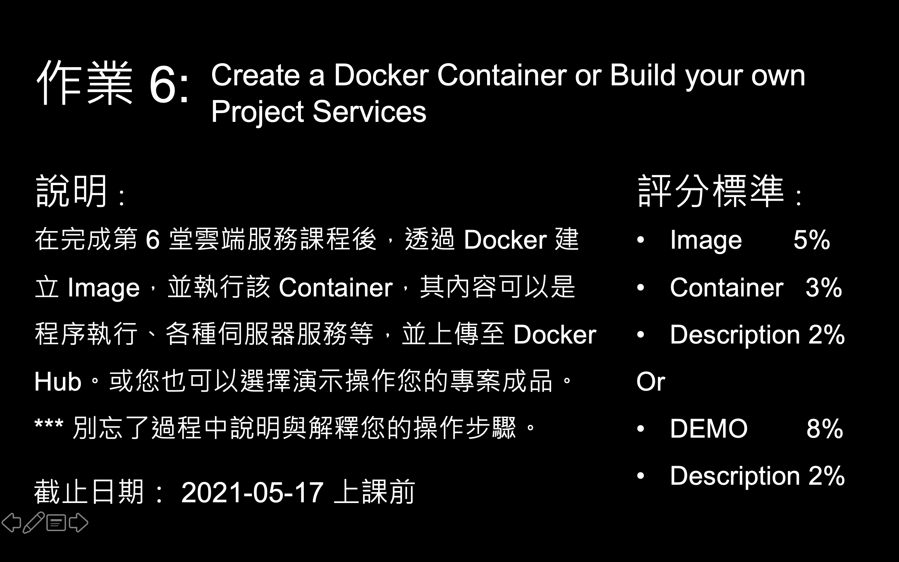

# FinTech
> Financial technology course in 109-2 (MDM65001)

## Homework 
### Homework 1
* **What do you think of Cloud Computing?** 
Cloud computing has become a popular technology in recent years. Due to its economies of scale, stability, and reduction in maintenance costs, many companies have gradually begun to use cloud computing to replace physical computers. The development can be more anticipated, especially in the post-epidemic era. For example, Zoom, which became popular at the beginning of the Covid-19, will grow 577% in business volume and 326% in total revenue in 2020; or the e-commerce platform that has exploded in usage will increase sales by 17.5% in the first half of 2020. These SAAS are proofs of the growth of cloud services, and purely for the growth of cloud computing, revenue increased by 20% in 2020. It can be seen that the growth of cloud computing not only has a very large rise, but also benefited from the post-epidemic era. Helping becomes one of the important trends in the future. 
雲端運算在近年來成為熱門的一個技術，由於其達到規模經濟的效益、穩定性以及維護成本的降低，許多企業已經開始逐漸由使用雲端運算取代實體電腦，尤其是在後疫情時代，雲端運算的發展更可以令人期待。像是疫情初期爆紅的zoom，在2020年業務量成長573%、總營收成長326%；或是使用量暴增的電商平台，2020上半年銷售金額增加17.5%，這些SAAS都是雲端服務成長的證明，而純粹在雲端運算的成長來說，在2020營收增加了20%，可見雲端運算的成長不僅有非常大的攀升，更是受惠於後疫情時代的助力，成為未來重要的趨勢之一。  
The three main service modes of cloud computing, IAAS, PAAS, and SAAS, are inseparable from our lives. All the webpages we can see on the Internet are basically SAAS. This is the cloud service that we usually come into contact with most often; For more data science talents and engineers, PAAS and IAAS are more commonly used in project collaboration and joint development. These cloud computing services that provide lower-level functions can be more freely and diversified to build their own required systems and programs. In addition, cloud computing has a highly scalable and highly stable distributed storage architecture. Whether it is collaboration or storage database, it has higher stability than physical computers. Therefore, it has become the mainstream used by many technology companies in recent years. Another feature of cloud computing is the node network. Its low latency and high transmission rate are also one of the reasons why cloud services can prevail. 
而雲端運算的三個主要服務模式IAAS, PAAS, SAAS與我們的生活中密不可分，所有我們能夠上網看到的一個網頁，基本上都是SAAS，這就是平常最常接觸到的雲端服務；而對更多資料科學領域人才、工程師來說，專案協作、共同開發中，更常用到的是PAAS以及IAAS，這些提供更底層功能的雲端運算服務，能夠更自由、更多樣的建置自己想要的系統及程式。且雲端運算擁有高可擴充性、高度穩定性的分散式儲存架構，不論是協作、儲存資料庫，比起實體電腦都擁有更高的穩定性，因此近年來成為許多科技公司使用的主流。另一個雲端運算的特點是節點網路，其低延遲、高傳輸速率的特點也是雲端服務能夠盛行的原因之一。  
I think cloud computing is a trend for us in the future. When the amount of data is getting larger and more valuable, the existence of our own hardware is far from enough, and even the storage is not safe and stable. Cloud computing The services of IAAS make it easier for us to obtain these data and computing resources from all over the world. It can be said to be a great boon to the field of data science, and the most commonly used service of IAAS, whether it is EC2, GCP or self-built The servers are all tools to help me build an environment when dealing with projects. In the future, I will also try to use AWS's PAAS service and use more AWS-provided systems to improve work efficiency. 
而我認為雲端運算對我們來說是未來使用的趨勢，當資料量越來越大，且資料越來越值錢時，存在自己的硬體已經遠遠不夠用，甚至儲存不夠安全穩定，雲端運算的服務讓我們更輕鬆地在世界各地取得這些資料以及運算資源，對資料科學的領域可以說是一大福音，而我目前最常用到的就是IAAS的服務，不論是EC2、GCP或是自己架設的Server，都是幫助我在處理專案時建置環境的利器，未來我也會嘗試使用AWS的PAAS服務，使用更多AWS提供的系統，提升工作的效率。

### Homework 2
* **Build a Website using Amazon EC2 with LAMPBuild a Website using Amazon EC2 with LAMP.** 
* &#8595; press the picture to access the video
* 

### Homework 3
* **HW3-Build a Website using Amazon S3(Versioning) and AWS Amplify.** 
* &#8595; press the picture to access the video
* 

### Homework 4
* **HW4-Build a Telegram Chatbot using Amazon API Gateway and AWS Lambda.** 
* &#8595; press the picture to access the video
* 

### Homework 5
* **HW5-Create a Database using Amazon RDS or Amazon DynamoDB.** 
* &#8595; press the picture to access the video
* 

### Homework 6
* **HW6-Create a Docker Container.** 
* &#8595; press the picture to access the video
* 

## Final Project

### 4/19 Three-minute interim results video
* [Slide](https://github.com/h30306/FinTech/blob/main/KPMG.pdf)
* &#8595; press the picture to access the video
* 

### 4/30 Three-minute interim results video
* &#8595; press the picture to access the video
* 

